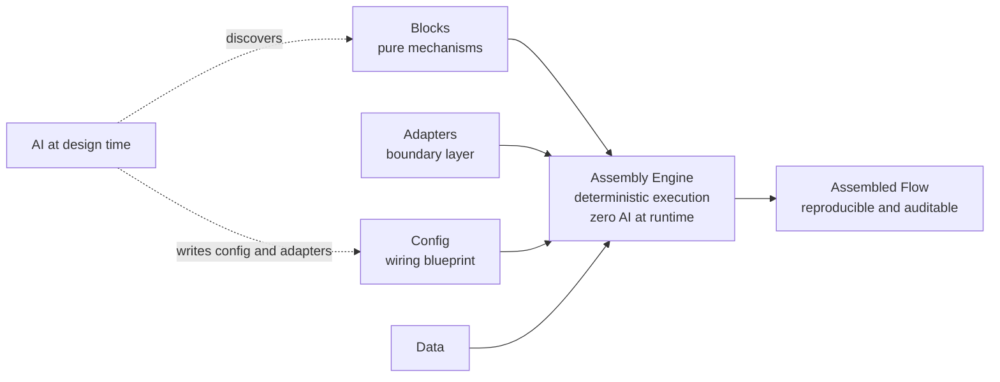

<!-- Derived from the Chinese README, which remains the source of truth. -->

# AssemFlow

> A research project exploring a stricter alternative to "vibe coding":
> can we keep AI on the design side and keep runtime execution fully deterministic?

**Current status:** research prototype, not a production promise.  
The project has completed **Sokoban MVP-2**: a playable browser demo with pushing, win detection, and explicit evidence about where AFP works and where it does not.

---

## What This Project Is

Most AI-assisted programming today asks the model to guess large chunks of code.
That is fast, but it is also hard to reproduce, hard to audit, and hard to govern.

AssemFlow tries a different discipline:

> Keep LLMs on the **design-time** side of the boundary:
> discovering reusable blocks, writing configuration, and building adapters under human review.
> Keep **runtime** on the deterministic side:
> plain code, explicit contracts, and **zero AI in execution**.

The upside is reproducibility and auditability.
The cost is that this discipline is narrower and less comfortable than "just let the model write everything".

So this repository is not an AI coding assistant.
It is closer to a **CAD tool for business blueprints plus a deterministic assembler**.

---

## What You Can Try Right Now

There are three practical entry points.

### 1. Play The Sokoban Demo

```powershell
cd experiments/exp06-sokoban
npm install
npm run dev
```

Open the local URL printed by Vite.
Use arrow keys or `WASD` to move.
Push every `$` onto `.` so that it becomes `*`.
Press `R` to reset.

Why this matters:

- The core turn logic is modeled as **one pure move-and-push block** plus **one pure win-check block**
- The flow is expressed as a **two-step AFP configuration**
- The browser-only control flow boundary is marked explicitly with `@paradigm`

### 2. Run The Engine And Earlier Validation Experiments

```powershell
# Engine: static checking, deterministic assembly, Mermaid graph output
cd engine
npm install
npm test

# A small validation experiment: same code, behavior changed by config
cd ../experiments/exp01-sweet-spot
npm install
npm test
```

Each experiment directory contains its own `README.md` and `REPORT.md` describing
what was tested, what held up, and what did not.

### 3. Read The Tutorial

[AFP Tutorial (12 lessons)](docs/tutorial/en/README.md)

This is the recommended path for first-time visitors.
It starts from the basics and ends at the Sokoban case.

---

## The Five Parts Of AFP

| Part | Role | Who Owns It |
| :--- | :--- | :--- |
| Block | Pure mechanism, reusable across business flows | Shared and reusable |
| Adapter | Boundary logic and anti-corruption layer | Local to each business case |
| Config | Declarative wiring blueprint | Generated at design time, reviewed by humans |
| Data | Runtime and test data | Provided by the business side |
| Flow | The assembled business flow built from the four parts above | Defined by config |

---

## How It Works



---

## Evidence So Far

| Stage | Question | Current result | Where to look |
| :--- | :--- | :--- | :--- |
| Sweet spot | Where does AFP fit naturally? | Confirmed in a linear registration-style flow | `experiments/exp01-sweet-spot/` |
| Boundary | Where should AFP not be used? | Condition-dense rule changes are outside the sweet spot | `experiments/exp02-boundary/` |
| Wrapping and reuse | Can blocks be wrapped and reused cleanly? | Confirmed | `experiments/exp03-wrap-reuse/` |
| MVP-0 | Where should long-lived state live? | Default starting point is caller-owned state (scheme A), not final | `experiments/exp04-k-state/REPORT.md` |
| MVP-1 | Can walking and browser rendering stay deterministic with the loop outside the engine? | Confirmed for turn-based event-driven play | `experiments/exp06-sokoban/REPORT.md` |
| MVP-2 | Can pushing and win detection still stay inside AFP data flow? | Confirmed for the core turn logic; control flow boundary remains outside | `experiments/exp06-sokoban/REPORT.md` |

---

## Sokoban Validation Roadmap

The project now uses **Sokoban** as its main validation chain.
The full roadmap is here:
[docs/paradigm-validation-sokoban-roadmap.md](docs/paradigm-validation-sokoban-roadmap.md)

| MVP | Focus | Status |
| :--- | :--- | :--- |
| MVP-0 | State-carrying comparison with a traffic light state machine | Done |
| MVP-1 | Walking plus rendering | Done |
| MVP-2 | Pushing plus win detection | Done |
| MVP-3 | 3 levels + standalone static checker (scoped-down) | 🕒 Planned (scoped-down) |
| MVP-4 | Undo + `@paradigm` judgment evidence (`maxMoves` as add-on, scoped-down) | 🕒 Planned (scoped-down) |

Important nuance:

- **MVP-2 is complete as an implementation milestone**
- **The final paradigm question is still open**
- `Q-028` is not resolved yet, because MVP-3 and MVP-4 are still needed to test
  "new content by pure data" and "behavior change by config only"

---

## What Is Already Strong, And What Is Still Open

### Already strong

- Deterministic engine core with explicit contracts
- Browser-playable Sokoban MVP-2
- Pure AFP blocks for move-and-push and win detection
- Explicit `@paradigm` marking for non-AFP control flow
- Test evidence plus implementation reports

### Still open

- Whether AFP remains the best shape when the problem becomes more dynamic
- Whether AI agents can reliably author configs and content at scale
- Whether larger Sokoban content sets still stay inside the same sweet spot
- Whether `inputMap` and flow signatures will need stronger expression power

---

## Why This Might Matter

The point of AssemFlow is not to prove that AFP is universally superior.
The point is to map a more honest boundary:

- where AI-generated configuration can be reviewed and trusted
- where deterministic execution gives you leverage
- where non-AFP paradigms win, and should be admitted openly

If this works, the result is not "AI writes all your code".
It is a more structured collaboration model:

**AI produces, humans review, machines execute deterministically.**

---

## How To Participate

This project currently benefits most from careful readers, skeptical reviewers, and honest external testing.

Useful ways to contribute:

- Read the docs and tell us where the reasoning is weak or unclear
- Challenge the current boundary claims with real counterexamples
- Try the Sokoban demo and report what is confusing or brittle
- Help extend or refine the scoped-down MVP-3 and MVP-4 once initial versions ship
- Run your own AI-agent experiments once the prompt pack is published

See [CONTRIBUTING.md](CONTRIBUTING.md) for the four ways to participate (from low-barrier feedback to code PRs).

---

## Documentation Map

- [Feasibility analysis](docs/装配流编程-可行性分析.md)
- [Tutorial](docs/tutorial/en/README.md)
- [Sokoban roadmap](docs/paradigm-validation-sokoban-roadmap.md)
- [Project state (SSOT)](docs/ai/state.json)
- [Paradigm comparison notes](docs/paradigm-comparison.md)
- [Core AFP discipline](.kiro/steering/afp-core.md)

