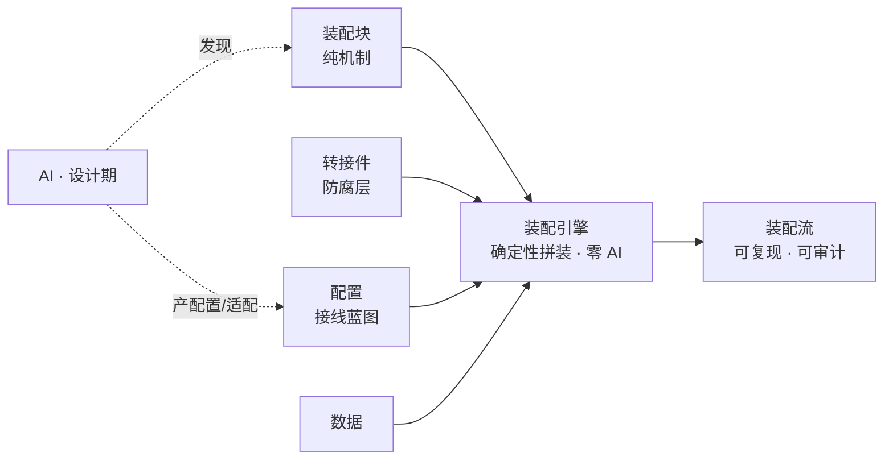

<!-- 语言：中文为内容真相源；英文版为翻译派生视图（待生成）。改中文须同步重生成英文。 -->

**中文** | English（待生成）

# AssemFlow · 装配流编程

> **装配流编程（Assembly Flow Programming, AFP）**——一种 AI 时代的编程范式：用可复用的"装配块"，经"转接件"按"配置"驱动、对"数据"操作，装配成业务的"装配流"。**AI 负责发现与配置，引擎负责确定性执行。**

AssemFlow 不是"AI 编程助手"，而是**业务蓝图的 CAD 工具 + 确定性编译器**。它与近邻划清边界：低代码"隐藏复杂度"，AFP"显式化复杂度并交给图去管"；vibe coding"让 AI 猜"，AFP"让 AI 填图"。

## 核心理念

AFP 的唯一楔子是**确定性纪律**：把 LLM 严格限定在"发现 + 配置 + 适配"一侧（设计期、有人审），把"执行"留在确定性纯代码一侧（运行期、零 AI）。这换来可复现、可审计、可治理——别人不愿守的纪律。

## 五元构件

| 构件 | 江河隐喻 | 身份 | 谁维护 |
| :--- | :--- | :--- | :--- |
| 装配块 Block | 河床 | 纯机制，与业务无关 | 全球共享，像 lodash |
| 转接件 Adapter | 都江堰 | 业务适配 / 防腐层 | 各业务自己写 |
| 配置 Config | 河图 | 接线蓝图，声明式策略 | 设计期 AI 产、人审 |
| 数据 Data | 河水 | 运行时 / 测试数据 | 业务方提供 |
| 装配流 Flow | 流动的河 | 由上四者组合出的业务流 | 配置定义 |

## 工作原理

## 技术栈

- 引擎：TypeScript（`@assemflow/core` 库 + 薄 CLI `assemflow check`/`graph`；`assemble` 仅库 API）
- 契约：TypeBox（产 JSON Schema）+ Ajv 双校验（输入+输出）
- 配置：JSON + JSON Schema（纯数据，物理上堵死"算法入配置"）
- 测试：vitest + fast-check（属性测试验证装配块的确定性纯机制）
- 可视化：Mermaid

## 当前状态

三个验证实验全部完成（甜区✅ 边界✅ 封装+复用✅），引擎 MVP 已实现（13 测试），教程 11 课已写。详细进度见 [`docs/ai/state.json`](docs/ai/state.json)。

## 文档导航

- [教程（11 课）](docs/tutorial/README.md) —— 从零学 AFP，由浅入深
- [可行性分析](docs/装配流编程-可行性分析.md) —— 范式的先例扫描与可行性论证
- [系统设计](docs/ai/system-design.md) —— 架构、目录、技术栈论证
- [项目状态](docs/ai/state.json) —— 进度、决策、下一步（单一真相源）
- 范式纪律（宪法）：`.kiro/steering/afp-core.md`
