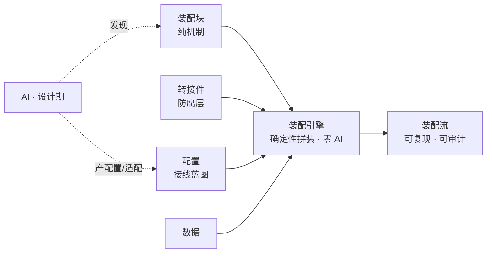

<!-- 语言：中文为内容真相源；英文版为翻译派生视图。改中文须同步重生成英文。 -->

**中文** | [English](README.en.md)

# AssemFlow · 装配流编程

> 一个阶段性收官的研究项目：**在 AI 时代，能不能把"AI 负责发现与配置、引擎负责确定性执行"这条纪律，做成一种可复现、可审计的编程范式？**

**当前阶段：研究稿 v0.1 · 阶段性收官（非生产承诺）。** Sokoban 验证链（MVP-0/1/2/3）与交付物 A 已完成，当前仓库保留的是**已跑通的证据链、仍然开放的问题，以及下一章候选方向**。这不是“AFP 已被最终证明”，而是一份到目前为止尽量诚实的阶段性结论。**欢迎围观、质疑、参与**——下面有适合上手的任务。

---

## 30 秒了解：这是什么、为什么可能重要

主流 AI 编程是"让 AI 猜整段代码"（vibe coding），结果不可复现、难审计。AFP 换一条路：

> 把 LLM 严格关在**设计期**的"发现 + 配置 + 适配"一侧（有人审），把**运行期**的"执行"留在确定性纯代码一侧（**零 AI**）。

换来的是可复现、可审计、可治理——代价是一套别人不愿守的纪律。AssemFlow 不是"AI 编程助手"，而是**业务蓝图的 CAD 工具 + 确定性编译器**。这个想法**可能成立、也可能在某些场景崩**，本项目的产出就是这份诚实的边界清单。

## 现在能摸到什么（约 1 分钟）

三种入口，选一个进：

### 能玩 · Sokoban 推箱子（MVP-3 已交付，3 关 + 独立校验 + URL 切关）

```powershell
cd experiments/exp06-sokoban
npm install
npm run dev
```

浏览器打开显示的地址：方向键 / WASD 推箱子，把所有 `$` 推到 `.` 上（变成 `*`）即胜利，按 R 重开。URL 可切关：`?level=level-push-1`（小关）/ `?level=level-push-big`（大关）/ `?level=level-walk-only`（走路对照）。**核心玩法 = 一个"走+推"纯装配块 + 一个"胜利判定"纯装配块 + 一份两步装配流配置**——教程第 12 课会把这条动线拆开讲。

独立校验工具（不启浏览器即可判定关卡合法性）：

```powershell
npm run check-level -- src/levels/publishable/level-push-big.txt
```

### 能跑 · 引擎与验证实验

```powershell
# 跑引擎：静态校验 + 确定性装配 + Mermaid 配置图
cd engine
npm install
npm test

# 跑一个验证实验（甜区假设：用户注册流，改配置不改代码）
cd ../experiments/exp01-sweet-spot
npm install
npm test
```

每个实验目录下都有 `README.md` / `REPORT.md`，记录它验证了什么、结论是什么、边界在哪。

### 能读 · 教程（推荐新访客从这里入）

[从零学 AFP · 12 课教程](docs/tutorial/README.md) —— 由浅入深，任何人都能跟着走；每课都能亲手跑、看到输出；最后一课回到 Sokoban 真项目。

## 五元构件（术语锚点）

| 构件 | 江河隐喻 | 身份 | 谁维护 |
| :--- | :--- | :--- | :--- |
| 装配块 Block | 河床 | 纯机制，与业务无关 | 全球共享，像 lodash |
| 转接件 Adapter | 都江堰 | 业务适配 / 防腐层 | 各业务自己写 |
| 配置 Config | 河图 | 接线蓝图，声明式策略 | 设计期 AI 产、人审 |
| 数据 Data | 河水 | 运行时 / 测试数据 | 业务方提供 |
| 装配流 Flow | 流动的河 | 由上四者组合出的业务流 | 配置定义 |

## 工作原理



## 已有的证据链（四个实验 + Sokoban 链 + 交付物 A）

| 议题 | 问题 | 结论 | 详情 |
| :--- | :--- | :--- | :--- |
| 甜区 | AFP 在什么场景最贴？ | 假设为真，已端到端跑在引擎上 | `experiments/exp01-sweet-spot/` |
| 边界 | 什么场景不该用 AFP？ | 条件密集的规则变更不在甜区 | `experiments/exp02-boundary/` |
| 封装+复用 | 块能否干净封装并跨流复用？ | 假设为真 | `experiments/exp03-wrap-reuse/` |
| 状态承载（MVP-0） | 长寿命状态存哪里？ | 阶段性默认"调用方持久化（A）" | `experiments/exp04-k-state/REPORT.md` |
| Sokoban 链（MVP-1/2/3） | AFP 在网格回合制游戏上能走多远？ | 核心玩法完全在甜区、回合控制流是合理边界（1 处 `@paradigm`） | `experiments/exp06-sokoban/REPORT.md` |
| **AI 产配置**（交付物 A · Q-003） | AI 能在 AFP 结构下产出合规配置吗？ | **✅ verified**（DeepSeek 单模型跨任务） · 硬边界纪律 5/5 通过 · 错误集中在"设计品味"而非"纪律违规" | `docs/agent-test-prompts.md` |

## 路线图：用 Sokoban 把想法压到底

我们把验证拆成一条 **MVP 链**，每步独立可交付、可单独得结论、可随时中止。全局地图见 [`docs/paradigm-validation-sokoban-roadmap.md`](docs/paradigm-validation-sokoban-roadmap.md)。

| MVP | 主题 | 状态 |
| :--- | :--- | :--- |
| MVP-0 | 状态机（红绿灯）状态承载对比 | ✅ 已完成（[REPORT](experiments/exp04-k-state/REPORT.md)） |
| MVP-1 | 走路 + 渲染 | ✅ 已完成（[REPORT](experiments/exp06-sokoban/REPORT.md#mvp-1-走路报告k-loop-结论--全量状态穿透观察)） |
| MVP-2 | 推箱子 + 胜利判定 | ✅ 已完成 · 发表闸口达标（[REPORT](experiments/exp06-sokoban/REPORT.md#mvp-2-推箱报告推箱--胜利判定--发表闸口)） |
| **MVP-3** | **3 关关卡集 + 独立静态校验工具 + URL 切关** | **✅ 已完成**（[REPORT](experiments/exp06-sokoban/REPORT.md#mvp-3-多关--独立校验报告3-关稳定重复--base-check-工具--url-切关)） |
| ~~MVP-4~~ | ~~撤销 + `@paradigm` 判据实证~~ | ⏸ **已归档**（[D-015 · 2026-07-03](docs/ai/decisions-archive.json)） |

Sokoban 链就此收官。MVP-4 归档理由：撤销机制的结论（大概率触发 1 处 `@paradigm`）几乎可预知、边际证据价值低；项目瓶颈在 Q-003 AI 产配置 / Q-001 演化 / 场景多样性三处，继续 MVP-4 会挤占更关键路径。重启触发条件见 `.kiro/specs/sokoban-mvp-4-tuning/requirements.md` 顶部归档说明。

## 想参与？

**这个项目暂时不缺代码，缺诚实读者**——愿意花时间读一遍、说一句"这里读不懂 / 这条我不信 / 我的场景是这样"的人。

参与门槛从低到高的四种形态（评论式反馈 / AI 自测 / 关卡贡献 / 代码 PR），以及每种的具体做法与期待，见 [**CONTRIBUTING.md**](CONTRIBUTING.md)。

## 文档导航

- [可行性分析](docs/装配流编程-可行性分析.md) —— 范式的先例扫描与可行性论证
- [教程（12 课）](docs/tutorial/README.md) —— 从零学 AFP
- [Sokoban 验证路线图](docs/paradigm-validation-sokoban-roadmap.md) —— 全局地图与 MVP 链
- [系统设计](docs/ai/system-design.md) · [项目状态（SSOT）](docs/ai/state.json) · 范式纪律（宪法）`.kiro/steering/afp-core.md`
