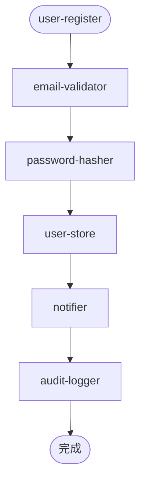

# 配置即图

> 本课目标：理解为什么"配置债看得见"是 AFP 的真正优势，以及引擎怎么做到。

## 代码债 vs 配置债

传统项目里，复杂度藏在代码深处——哪个函数依赖哪个、改一处影响多少，要人肉读代码才知道。这就是代码债**看不见**。

AFP 把复杂度搬到配置里。配置是纯数据（JSON），天生是一张**图**：
- 节点 = 块
- 边 = 步骤的先后顺序 + inputMap 的引用关系

图可以被机器直接分析——这就是"配置债**看得见**"。

## 引擎能静态算出什么

| 能力 | 做什么 | 不执行任何块就能判断 |
| :--- | :--- | :--- |
| 悬空引用 | 配置里引用了一个不存在的块 → 报错 | ✅ |
| 契约对齐 | 上步输出类型和下步输入类型不匹配 → 报错/警告 | ✅ |
| 死配置 | params 里声明了但没人用的参数 → 警告 | ✅ |
| where-used（待实现） | "改了这个块会影响哪些流" | ✅ |
| 影响面（待实现） | "改了这个配置参数会波及哪些步骤" | ✅ |

这些全部在**拼装之前、不执行代码**就能算出来——就像编译器在运行前就能报类型错误。

## 试一下

用引擎的 check 跑实验①的配置（需要编程方式注册块，CLI 只做格式校验）：

```powershell
cd engine
npm test
```

看 `check（静态校验）` 和 `check · 契约对齐` 相关测试——它们验证了引擎在不执行块的情况下就能发现问题。

## Mermaid 可视化

引擎的 `graph` 命令把配置变成 Mermaid 图：



配置的结构**一目了然**。改了配置 → 重新生成图 → diff 就能看出"这次改了什么"。

## 一句话

> 代码债看不见，配置债看得见。这不是弱点，是 AFP 该兑现的优势。

→ 回到 [学习地图](README.md)
