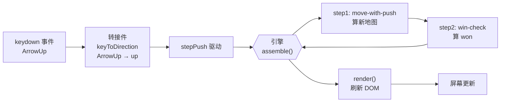

# 看真实项目：Sokoban 推箱子

> 本课目标：把前 11 课学的五元构件，放进一个真项目里看长什么样。不再是"注册流"这种教学 demo——这次是别人一眼认得出、能上手玩的**推箱子游戏**（Sokoban）。

## 为什么用 Sokoban 收官

前 11 课基于三个教学实验（用户注册 / 折扣计算 / lodash 复用）。它们证明了范式能成立、也画出了边界，但**都是"教学场景"**——真项目往往会长出意料之外的形态。

Sokoban 是路线图选定的"终极压力测试"标的：

- **全民熟知**：规则一句话——把箱子推到目标格上就赢——不需要业务背景。
- **回合制**：每次按键 = 一回合 = 一趟确定性装配，恰好落在 AFP 甜区。
- **纯净数据**：每关是一份 ASCII 文本（`# . @ $ *`），"加一关 = 加一份数据"直接实证 AFP 的核心承诺。
- **有难点**：胜利判定后要拒绝方向键、按 R 重开——这类"跨回合控制流"AFP 数据流表达不了，是**边界的诚实标本**。

**MVP-2 已完成**（typecheck 0 错 / 12 文件 94 测试全过 / 真人浏览器验收通过），本课带你看它是怎么用 AFP 拼出来的。

## 玩一下（30 秒）

```powershell
cd experiments/exp06-sokoban
npm install
npm run dev
```

浏览器打开显示的地址。方向键 / WASD 推箱子；把所有 `$` 推到 `.` 上（变成 `*`）即胜利；按 R 重开。

先玩一遍再往下读——本课接下来讲的每件事，你都能对上画面里的一次动作。

## 五元构件在 Sokoban 里的具身

回想第 02 课的表：装配块 / 转接件 / 配置 / 数据 / 装配流。Sokoban 是怎么填这五格的？

| 零件 | 在 Sokoban 里是 | 文件 |
| :--- | :--- | :--- |
| **装配块** ×2 | `move-with-push`（走+推纯机制）· `win-check`（胜利判定纯机制） | `src/blocks/move-with-push.ts` · `src/blocks/win-check.ts` |
| **转接件** ×1 | `keyToDirection`（浏览器物理按键 → 逻辑方向） | `src/adapters/input-adapter.ts` |
| **配置** ×1 | `push.jsonc`（两步装配流：move → win） | `src/configs/push.jsonc` |
| **数据** ×2 | 关卡 ASCII 文本 → `parseLevel` 装出的 `GridState` | `src/levels/level-push-1.txt` |
| **装配流** ×1 | `sokoban-push`（由上面四样拼成） | 由 `push.jsonc` 定义 |

对上第 02 课"哪个能复用、哪个不能"的结论——**两个纯装配块 `move-with-push` / `win-check` 是全球可复用的**（其它推箱游戏可以直接用），转接件、配置、关卡数据是这一个项目的资产。

## 装配流长什么样

打开 `src/configs/push.jsonc`：

```jsonc
{
  "flowName": "sokoban-push",
  "steps": [
    { "block": "move-with-push", "inputMap": { "grid": "grid", "direction": "direction" } },
    { "block": "win-check",       "inputMap": { "grid": "nextGrid" } }
  ]
}
```

两行 `steps`，两条 `inputMap`——**这就是"一次按键要做的全部事"**。没有算法、没有条件、没有循环。step2 的 `"grid": "nextGrid"` 是纯字段重命名（把上一步输出接给下一步的输入）。

对上第 07 课的红线一（"算法不入配置"）——推箱的判断逻辑（"目标格是墙还是箱？箱后能不能推？"）**全部封在 `move-with-push` 块里**，配置只做接线。

## 一次按键背后：数据流

按一次上键，从物理按键到屏幕更新，经历了什么？



**关键**：引擎单趟执行两个块，中间只做字段重命名——**没有任何 if/else / 循环 / 隐藏胶水**。配置里看到的就是运行时发生的。

## 边界：诚实的 10%

如果 Sokoban 全落在 AFP 里就完美了——但事实不是。**通关后按方向键要"没反应"、按 R 要"重开"、通关瞬间要"拦下最后一次输入"**——这三条控制流塞不进上面那份 `push.jsonc`。

原因：它们是**跨回合的时间维度状态 + 事件级条件分支**：

- "通关后拒绝方向键"依赖"上一回合是否已通关"——跨回合记忆。
- "按 R 重开"是事件级分支——按 R 走一条路，按其它键走另一条。
- 如果硬塞进配置，就要在 `push.jsonc` 里加条件分支——**违反第 07 课红线一**（配置图必须静态可枚举）。
- 如果推进引擎，就要给引擎加"loop step"——**违反 MVP-1 K-LOOP 结论**（回合制不需要引擎循环）。

正确做法：**把这 10% 显式挪到浏览器侧、打上标记**。

打开 `src/main.ts` 文件头：

```ts
/**
 * @paradigm NON-AFP: external-control-flow
 * @reason 回合门控（won → 拒绝方向键）、终局输入拦截、R/r 重开三条控制流
 *         是"跨回合的时间维度状态 + 事件级条件分支"，AFP 数据流表达不了。
 *         留在浏览器 keydown 回调里是最简解。
 * @afp-debt 验证期结论：AFP 数据流不承担回合控制流是合理边界，非 AFP 在此处胜出。
 */
```

三个字段（`@paradigm` + `@reason` + `@afp-debt`）齐备——**这是 AFP 的诚实工具**：跑一次 `grep "@paradigm" src/` 就能列出所有偏离 AFP 数据流的地方，读者一眼看到"这里为什么不用 AFP"。

跑一下这个 grep：

```powershell
cd experiments/exp06-sokoban
Get-ChildItem -Path src -Recurse -File | Select-String -Pattern "@paradigm NON-AFP"
```

**结果**：整份 Sokoban 代码里，恰好 1 处代码标记，位于 `src/main.ts`。业务逻辑层（`src/blocks/**`、`src/configs/**`、`src/adapters/**`、`src/grid.ts`、`src/driver.ts`）全部零标记——AFP 覆盖了 Sokoban 玩法的 90%。

## 通俗解读

上面这些细节合起来说的其实是一件事：

> **AFP 数据流能承担 Sokoban 核心玩法（走路 + 推箱 + 胜利判定），但不承担回合控制流。这不是失败——是合理边界。**

- 能承担的部分（90%）：干净、可读、纯装配块 + 配置能表达。加新关卡 = 加一份 ASCII 文本，不改代码。
- 承担不了的部分（10%）：跨回合状态 + 事件级分支——如实标记出来，读者能一眼看到"为什么这里换范式"。

对上第 08 课"什么时候别用 AFP"——**Sokoban 不是"要么全用 AFP，要么全不用"**，而是**"90% 用 AFP，10% 用其它范式并标记"**。这个诚实的分工是本项目的核心叙事（"寻找 AI 介入模式下的更优编程范式"，而不是"证明 AFP 是银弹"）。

## 深潜链接

- **完整工程报告**（含通俗解读六节）：[`experiments/exp06-sokoban/REPORT.md`](../../experiments/exp06-sokoban/REPORT.md)
- **范式分布与适用域对比**（跨 MVP 交付物 B）：[`docs/paradigm-comparison.md`](../paradigm-comparison.md)
- **MVP-2 完整 spec**（Requirements → Design → Tasks）：`.kiro/specs/sokoban-mvp-2-push/`
- **验证路线图**（MVP-0 到 MVP-4 全景）：[`docs/paradigm-validation-sokoban-roadmap.md`](../paradigm-validation-sokoban-roadmap.md)

## 一句话收束

> 教学 demo 会让你相信 AFP 能行；真项目让你看到 AFP 在哪里行、在哪里让位。这两件事，只有摊开在同一个可玩的东西上，才能被同时看见。

Sokoban 就是那个可玩的东西。

→ 回到 [学习地图](README.md)
