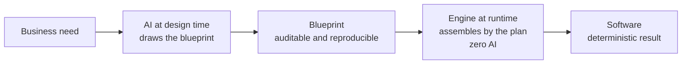

<!-- Derived from the Chinese tutorial, which remains the source of truth. -->

# What AFP Is In One Picture

> Goal of this lesson: avoid jargon for now and first build an intuition for what Assembly Flow Programming is doing.

## An Analogy

Imagine two ways to build a house.

One way is to let the workers think while they build. It is fast, but you never really know what the next move will be, and if something goes wrong it is hard to explain where the mistake came from.

The other way is to have a designer draw a **construction plan** first. Humans review the plan, and then the construction team follows it. The builders do not improvise. Whoever builds it, and however many times they build it, the result stays the same.

**Assembly Flow Programming (AFP) picks the second way.**

- AI acts like the designer: it understands the need and produces an auditable **blueprint**.
- The engine acts like the construction team: it assembles software **deterministically** from that blueprint. Runtime has no AI in it.

## The Picture

## How This Differs From Letting AI Write Code Directly

| | Let AI write code directly | AFP |
| :--- | :--- | :--- |
| What AI produces | Code | An auditable blueprint |
| Who executes | The model keeps guessing while writing | The engine assembles deterministically from the blueprint |
| Is it reproducible? | Hard; each generation may differ | Yes; same blueprint, same result |
| Is it easy to inspect? | Hard; logic is hidden in generated code | Easier; the blueprint is visible |

In one sentence: **ordinary AI coding asks the model to guess; AFP asks the model to fill out a plan.**

## One-Sentence Definition

> A business flow is assembled from reusable **blocks**, business-specific **adapters**, declarative **config**, and concrete **data**. AI helps discover and configure them; the engine executes them deterministically.

The next lesson breaks that sentence into five concrete parts.

-> [The Five Parts](02-five-parts.md)
