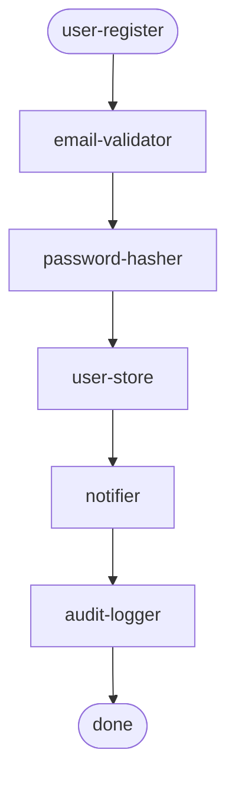

<!-- Derived from the Chinese tutorial, which remains the source of truth. -->

# Config As Graph

> Goal of this lesson: understand why visible config debt is a real advantage of AFP, and how the engine can use that fact.

## Code Debt Versus Config Debt

In traditional projects, complexity is buried in code. Which function depends on which other function, and how far a change propagates, often requires manual reading. Code debt is mostly invisible.

AFP moves complexity into config. Config is pure data, and pure data is naturally a **graph**:

- nodes are blocks
- edges come from step order and `inputMap` references

That means machines can analyze the graph directly. This is what it means to say config debt is **visible**.

## What The Engine Can Compute Statically

| Capability | What it detects | Can it be known without running any block? |
| :--- | :--- | :--- |
| Dangling references | Config refers to a block that does not exist | Yes |
| Contract alignment | One step's output type does not match the next step's input type | Yes |
| Dead config | A declared param is never used | Yes |
| Where-used analysis (planned) | "Which flows depend on this block?" | Yes |
| Change impact (planned) | "Which steps are affected by this config field?" | Yes |

All of this can be computed **before assembly and without executing block code**, in the same spirit that a compiler reports type errors before runtime.

## Try It

The engine CLI already wires its `check` command into real static validation, provided you give it a block manifest:

```powershell
cd engine
npx tsx src/cli.ts check <config.json> --blocks <manifest.json>
```

It checks dangling references, contract alignment, and dead config without executing any blocks.

If the config references a missing block, you should see an error like this:

```text
[step 0] Block "nonexistent" is missing from the registry
```

Runtime assembly uses the library API rather than the CLI. The tests in `engine/tests/engine.test.ts` show how that is called.

To inspect the relevant tests:

```powershell
cd engine
npm test
```

The `check` tests confirm that the engine can find structural problems without executing blocks.

## Mermaid Visualization

The engine's `graph` command can turn config into a Mermaid flow diagram:



The structure becomes visible at a glance. Change the config, regenerate the graph, and the diff shows what really changed.

## One Sentence

> Code debt is hard to see. Config debt is visible. In AFP, that is not a weakness. It is a promised advantage.

-> Back to the [Learning Map](README.md)
