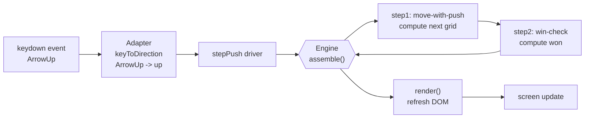

<!-- Derived from the Chinese tutorial, which remains the source of truth. -->

# A Real Project: Sokoban

> Goal of this lesson: take the five-part model from the first 11 lessons and look at what it becomes inside a real project. This is no longer a teaching demo such as a registration flow. It is a recognizable, playable Sokoban game.

## Why Sokoban Is The Final Lesson

The first 11 lessons are built on three teaching experiments: user registration, discount calculation, and lodash reuse. They show that the paradigm can work and they map an initial boundary, but they are still **teaching scenes**. Real projects tend to produce shapes that teaching examples do not.

Sokoban was selected as the roadmap's pressure test for four reasons:

- **Everyone knows the rules**: push every box onto a goal tile and you win.
- **It is turn-based**: one keypress is one turn, which fits AFP's deterministic sweet spot.
- **Its content is clean data**: each level is an ASCII file using `# . @ $ *`, so "add a level" can literally mean "add one more data file."
- **It has an honest hard boundary**: after a win, direction keys should stop working, and `R` should reset the game. That kind of cross-turn control flow does not fit AFP's data flow cleanly.

**MVP-2 is complete** in the current repository. This lesson explains how AFP was used to build it.

## Try It In 30 Seconds

```powershell
cd experiments/exp06-sokoban
npm install
npm run dev
```

Open the local URL printed by Vite.
Use arrow keys or `WASD` to move.
Push every `$` onto `.` so that it becomes `*`.
Press `R` to reset.

Play once before reading further. Almost every point below becomes easier to understand once you have seen one move happen on screen.

## The Five Parts Inside Sokoban

How do the five parts from Lesson 02 map onto the Sokoban project?

| Part | In Sokoban | File |
| :--- | :--- | :--- |
| Block x2 | `move-with-push` and `win-check` | `src/blocks/move-with-push.ts`, `src/blocks/win-check.ts` |
| Adapter x1 | `keyToDirection` turns browser keys into logical directions | `src/adapters/input-adapter.ts` |
| Config x1 | `push.jsonc`, a two-step flow: move, then win-check | `src/configs/push.jsonc` |
| Data x2 | ASCII level text parsed into `GridState` | `src/levels/level-push-1.txt` |
| Flow x1 | `sokoban-push`, assembled from the four parts above | defined by `push.jsonc` |

This matches the rule from Lesson 02: **the pure blocks are reusable, while the adapter, config, and level data belong to this project.**

## What The Flow Looks Like

Open `src/configs/push.jsonc`:

```jsonc
{
  "flowName": "sokoban-push",
  "steps": [
    { "block": "move-with-push", "inputMap": { "grid": "grid", "direction": "direction" } },
    { "block": "win-check", "inputMap": { "grid": "nextGrid" } }
  ]
}
```

That is the whole meaning of a keypress in config form: two steps and two field mappings. There is no algorithm, no loop, and no hidden control structure. The line `"grid": "nextGrid"` is just a field rename that passes the output of one step into the input of the next.

This matches Red Line One from Lesson 07. The actual push logic stays inside the `move-with-push` block. Config only does wiring.

## The Data Flow Behind One Keypress

What happens when the user presses ArrowUp?



The key point is that the engine executes the two blocks in one pass and only performs field renaming in between. No hidden `if`, no loop, no secret glue.

## The Honest 10 Percent Boundary

If Sokoban fit completely inside AFP, that would be wonderfully clean. But it does not.

After the game is won, direction keys should stop doing anything. Pressing `R` should reset the level. The final winning input needs special gating. These are all **cross-turn control-flow concerns**, and they do not fit naturally into the static `push.jsonc` flow.

Why not?

- refusing input after a win depends on whether the **previous turn** already reached the terminal state
- `R` is an event-level branch: one key takes one path, other keys take another
- forcing this into config would mean pushing time-sensitive branching into a static graph
- pushing it into the engine would mean reintroducing a loop structure that MVP-1 intentionally kept outside the engine

So the honest move is: **keep this 10 percent outside AFP and mark it explicitly.**

Open the file header of `src/main.ts`:

```ts
/**
 * @paradigm NON-AFP: external-control-flow
 * @reason Turn gating after win, final-input interception, and R/r reset
 *         are cross-turn state and event-level branching. Forcing them into
 *         AFP would either push branching into config or push the main loop
 *         into the engine. Keeping them in the browser keydown callback is
 *         the simplest solution.
 * @afp-debt The current conclusion is that AFP should not own turn control flow.
 *           This debt is not meant to be repaid: it is positive evidence for
 *           the D-013 boundary claim rather than an unfinished mistake.
 */
```

Those three fields - `@paradigm`, `@reason`, and `@afp-debt` - are AFP's honesty tool. A simple grep can list every place where the implementation steps outside AFP data flow.

Try it:

```powershell
cd experiments/exp06-sokoban
Get-ChildItem -Path src -Recurse -File | Select-String -Pattern "@paradigm NON-AFP"
```

In the current Sokoban codebase, the result points to exactly one place: `src/main.ts`.

## The Plain-Language Reading

All these details add up to one statement:

> **AFP data flow can carry Sokoban's core gameplay - walking, pushing, and win detection - but it should not own turn control flow. That is not failure. It is a credible boundary.**

- The 90 percent that fits is clean, readable, and expressible through pure blocks plus config.
- The 10 percent that does not fit is marked honestly so readers can see why another paradigm takes over there.

That matches Lesson 08. Sokoban is not "all AFP or no AFP." It is "use AFP for the 90 percent where it is strongest, and use another paradigm for the remaining 10 percent while marking the boundary honestly."

## Deeper Links

- **Full engineering report**: [`experiments/exp06-sokoban/REPORT.md`](../../../experiments/exp06-sokoban/REPORT.md)
- **Paradigm comparison notes**: [`docs/paradigm-comparison.md`](../../paradigm-comparison.md)
- **Full MVP-2 spec**: `.kiro/specs/sokoban-mvp-2-push/`
- **Validation roadmap**: [`docs/paradigm-validation-sokoban-roadmap.md`](../../paradigm-validation-sokoban-roadmap.md)

## One-Sentence Summary

> Teaching demos can make you believe AFP might work. A real project shows where it works and where it must yield. You need both on the same playable thing to see the boundary honestly.

Sokoban is that playable thing.

-> Back to the [Learning Map](README.md)
